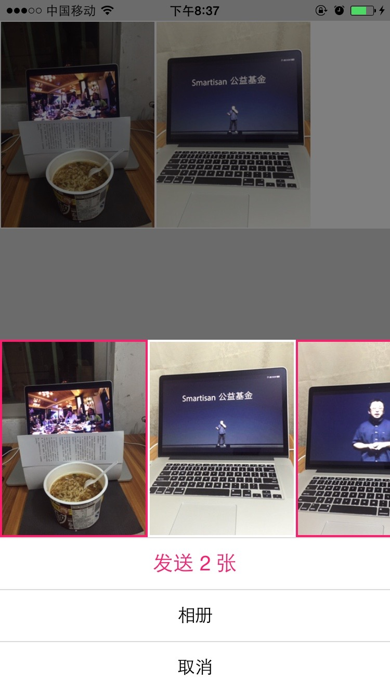
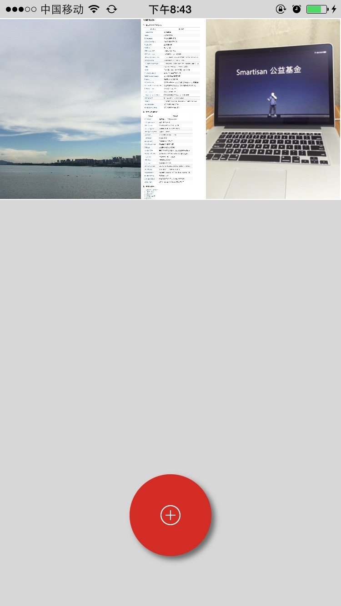

##CocoaPicker --仿QQ图片选择器


###如何使用

 ```objective-c
  self.view.window.rootViewController.modalPresentationStyle = UIModalPresentationCurrentContext;//半透明
  CocoaPickerViewController *transparentView = [[CocoaPickerViewController alloc] init];
  transparentView.delegate = self;
  transparentView.modalPresentationStyle = UIModalPresentationOverFullScreen;
  transparentView.view.frame=self.view.frame;
  transparentView.view.superview.backgroundColor = [UIColor clearColor];
  [self presentViewController:transparentView animated:YES completion:nil];
```
      


###截图0


 

###截图1

 


